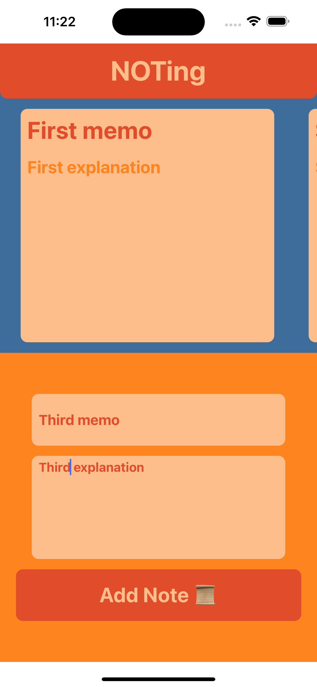
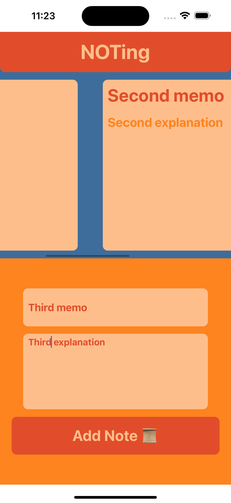

# second-week-homework

### ikinci haftanın ödevi: 
  - bu hafta işlenen konuları içeren bir uygulama geliştirilecek
  - bu uygulamada en azından bir iki tane üçüncü parti kütüphane kullanılacak
  - Responsive tasarıma dikkat edilecek

## Screenshots
 
